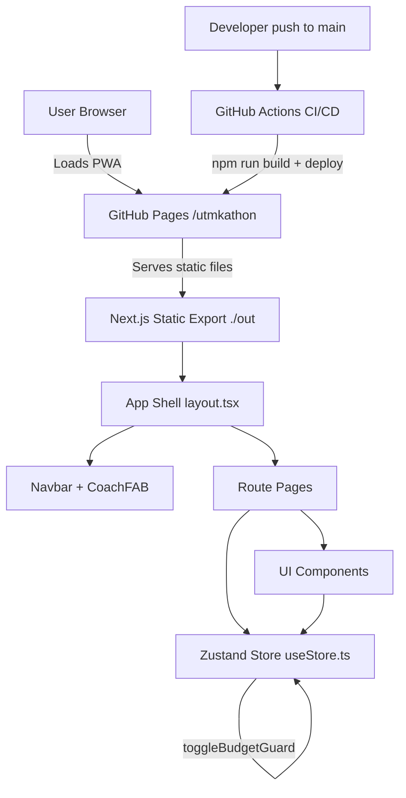

# Resilience Agent — System Architecture

> Last reviewed: 2026-05-05

## High-Level Overview

A fully **client-side static PWA** built with Next.js App Router, exported as flat HTML/JS/CSS files and served via GitHub Pages. There is no server, API, or database — all state lives in the browser via Zustand.

```
Browser (PWA)
└── Next.js Static Export (./out)
    ├── App Router pages (pre-rendered HTML)
    ├── Zustand in-memory store
    └── Simulated AI / async logic (setTimeout)

GitHub Pages (/utmkathon)
└── Hosts the ./out static files
    └── Deployed via GitHub Actions on push to main
```

## Main Components / Modules

```
┌─────────────────────────────────────────────────────────┐
│                     App Shell                           │
│  layout.tsx → <Navbar /> + <CoachFAB /> + {children}   │
└────────────────────────┬────────────────────────────────┘
                         │
         ┌───────────────▼────────────────┐
         │         Route Pages            │
         │  /          → Landing          │
         │  /dashboard → Dashboard        │
         │  /scan      → Scanner          │
         │  /transfer  → Transfer         │
         │  /coach     → Coach (AI Chat)  │
         │  /agents    → AgentCommandCenter│
         │  /debt-shield → DebtShield     │
         │  /savings   → Savings          │
         │  /reports   → Reports          │
         │  /transactions → Transactions  │
         │  /settings  → Settings         │
         └───────────────┬────────────────┘
                         │
         ┌───────────────▼────────────────┐
         │        Zustand Store           │
         │  useStore.ts                   │
         │  - user profile & balance      │
         │  - transactions[]              │
         │  - savingsPockets[]            │
         │  - agents[]                    │
         │  - resilienceScore             │
         │  - cashflowRisk                │
         │  - safeDailySpend              │
         │  - isBudgetGuardActive         │
         └────────────────────────────────┘
```

## Data Models

### `Transaction`
| Field | Type | Notes |
|---|---|---|
| `id` | string | Unique identifier |
| `title` | string | Merchant / description |
| `amount` | number | Always positive |
| `category` | string | e.g. Food, Transport, Shopping |
| `date` | string | ISO 8601 |
| `type` | `'expense' \| 'income'` | Determines balance direction |
| `confidence` | number? | AI classification confidence (0–1) |

### `Agent`
| Field | Type | Notes |
|---|---|---|
| `id` | string | e.g. `'orch'`, `'spend'` |
| `name` | string | Display name |
| `status` | `idle \| analyzing \| alert \| action` | |
| `latestFinding` | string | Simulated AI output |
| `confidence` | number | 0–1 |
| `recommendedAction` | string | Actionable suggestion |
| `tools` | string[] | Descriptive tool labels (not called) |

### `SavingsPocket`
| Field | Type |
|---|---|
| `id` | string |
| `name` | string |
| `target` | number |
| `current` | number |
| `icon` | string (emoji) |

## Request / Data Flow

### Typical User Interaction (e.g. QR Pay)
```
User taps PAY (Navbar)
  → /scan route renders Scanner.tsx
  → Simulates camera scan (setTimeout, 2s)
  → Displays hardcoded merchant + amount
  → AI intercept checks: amount > safeDailySpend?
      └── YES → shows warning card
  → User confirms → addTransaction() called on Zustand store
      └── balance updated in memory
  → router.push("/dashboard")
```

### State Mutation
All state changes go through Zustand actions. No API calls, no persistence:
```
UI Event → Zustand action (addTransaction / toggleBudgetGuard) → re-render
```

## Frontend Structure

### Navigation
- **Bottom Navbar** (`Navbar.tsx`): Fixed bar with 4 nav links + central floating **PAY** button (→ `/scan`)
- **Floating Action Button** (`CoachFAB.tsx`): Always-visible coach shortcut (→ `/coach`)
- Navbar is **hidden** on the landing page (`pathname === '/'`)

### Design System
- Tokens defined in `globals.css` (Tailwind CSS v4 custom properties)
- Primary brand color: `#1E3A8A` (deep blue)
- Glass-card utility class used throughout
- Animations: Framer Motion (`motion.div`, `AnimatePresence`)

### Component Responsibilities

| Component | Role |
|---|---|
| `Dashboard.tsx` | Stats, quick actions, AI insights, mini transaction list |
| `Scanner.tsx` | QR pay simulation + AI cashflow intercept |
| `Transfer.tsx` | Derived cashflow prediction (no `useEffect`) |
| `Coach.tsx` | Chat UI with suggestion chips + simulated AI replies |
| `AgentCommandCenter.tsx` | Read-only agent status cards from store |
| `DebtShield.tsx` | Debt risk display + Budget Guard / Survival Mode toggles |
| `Reports.tsx` | Recharts PieChart + milestone cards |
| `Settings.tsx` | Preferences toggles + AnimatePresence logout modal |
| `BudgetGuardModal.tsx` | Modal launched from Dashboard insight card |

## Authentication / Authorization

**None implemented.** The sign-out flow in `Settings.tsx` navigates to `/` using `router.push("/")`. No tokens, sessions, or cookies exist.

## External Services / Integrations

| Service | Status | Notes |
|---|---|---|
| LLM / AI API | ❌ Not integrated | Responses are hardcoded strings |
| Payment Gateway | ❌ Not integrated | QR + Transfer are fully simulated |
| Database (Supabase, etc.) | ❌ Not integrated | In-memory only |
| Analytics | ❌ Not detected | — |
| Push Notifications | ❌ Not implemented | Manifest exists, no SW registered |

## Deployment / Runtime

```
Developer machine
  └── npm run build → generates ./out (static HTML/CSS/JS)

GitHub Actions (on push to main)
  ├── actions/checkout@v4
  ├── Node.js 20
  ├── npm ci → install deps
  ├── next build → produces ./out
  ├── actions/upload-pages-artifact@v3 (path: ./out)
  └── actions/deploy-pages@v4 → publishes to GitHub Pages

Live URL: https://pwntable.github.io/utmkathon/
Base path: /utmkathon (set in next.config.ts)
```

### Key Config (`next.config.ts`)
```ts
output: 'export'          // Static HTML export
basePath: '/utmkathon'    // Sub-directory on GitHub Pages
assetPrefix: '/utmkathon/'
images: { unoptimized: true } // Required for static export
typescript: { ignoreBuildErrors: true } // Stability workaround
```

## Architecture Diagram


